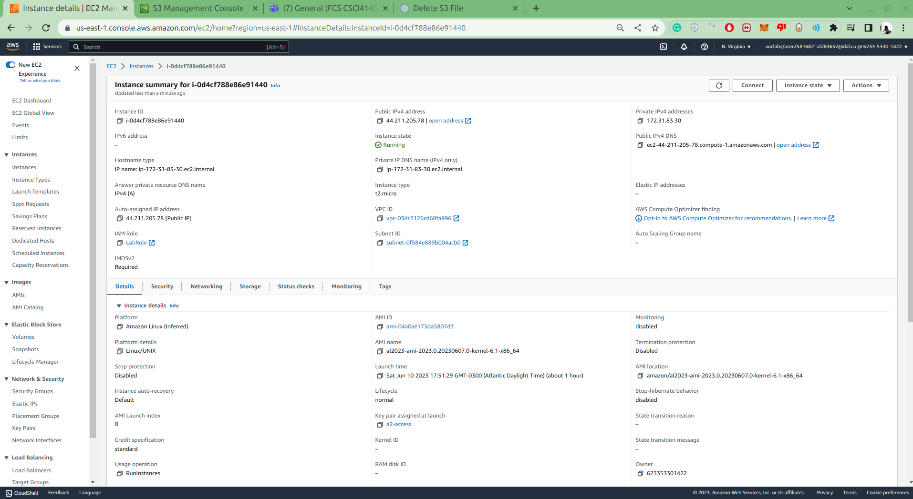
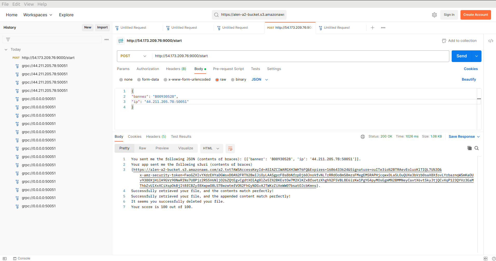
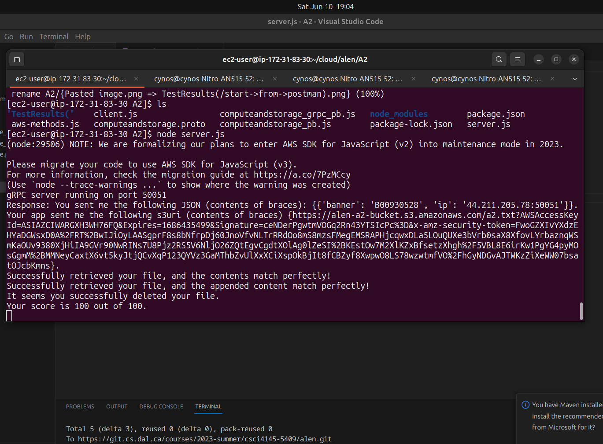

<!--- The following README.md sample file was adapted from https://gist.github.com/PurpleBooth/109311bb0361f32d87a2#file-readme-template-md by Gabriella Mosquera for academic use ---> 

# CSCI 5409 - Assignment 2

This node app implements a gRPC server that performs CRUD operations on a S3 bucket.
The app was deployed on an EC2 instance

* *Date Created*: 10 June 2023
* *Last Modification Date*: 10 June 2023

## Authors

* Alen John (al283652@dal.ca) - Developer

## Screenshots
* 
* 
* 

## Built With

* [Node.js](https://nodejs.org/en/docs) - The JavaScript backend
* [AWS-SDK](https://aws.amazon.com/sdk-for-javascript/) - AWS SDK
## Sources Used

1) https://www.youtube.com/watch?v=Yw4rkaTc0f8&t=2771s - Guide on GRPCs with Node
2) https://blog.postman.com/testing-grpc-apis-with-postman/ - Guide on testing GRPCs with PostMan
3) https://docs.aws.amazon.com/AmazonS3/latest/userguide/example_s3_PutObject_section.html - How to upload to S3
4) https://stackoverflow.com/questions/27753411/how-do-i-delete-an-object-on-aws-s3-using-javascript - how to delete object

## Acknowledgments
* Prof. Hawkey and all the TAs.
* AWS
* CSCI5409 course material from Brightspace
* Gitlab
* Node

